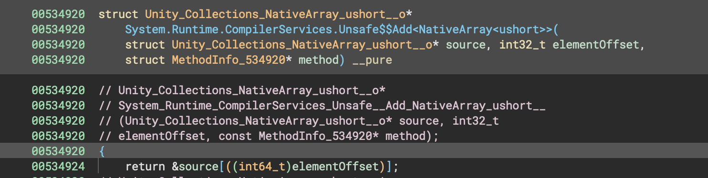
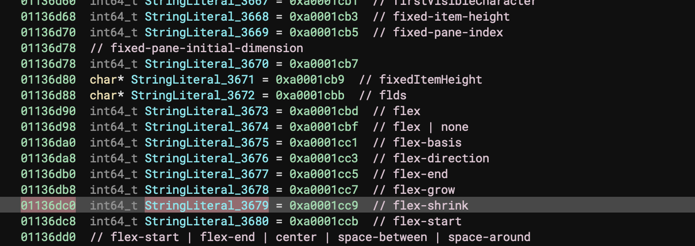
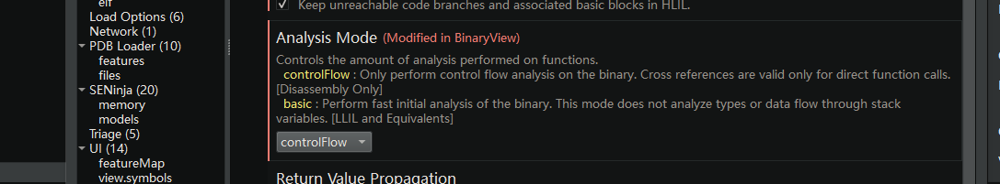

## il2cpp_bn

将il2cppdumper的符号信息导入binaryninja中，就像使用其自带的脚本导入ida中一样

实现了

更改函数名称及声明 并将声明自动注释


导入string并注释



## 使用方法

建议open with option打开 

选择 

可以避免过长的反编译所有函数的等待时间


先使用il2cpp dump获取script.json和il2cpp.h

在il2cpp.h的头部增加

(64位)
```
#define intptr_t int64_t
#define uintptr_t uint64_t
```

然后使用bn的内置功能 ctrl+p  搜索 'Import Header File'

导入il2cpp.h

然后使用插件,选择对应的功能

根据提示选中script.json 等待即可

## 不足

没有找到自动导入头文件的api函数 只能手动导入

## 感谢

感谢 @mFallW1nd 提供的优化思路，通过手动parser，获取type的方式避免了使用bv.parse_types_from_string的性能问题
